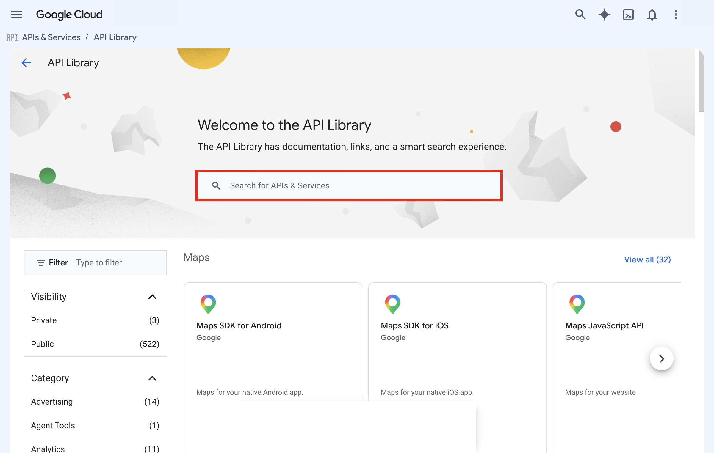
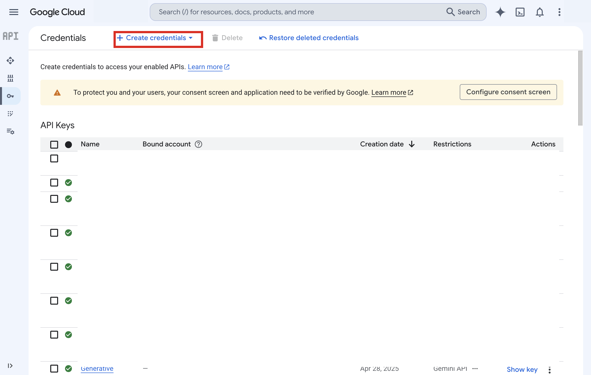
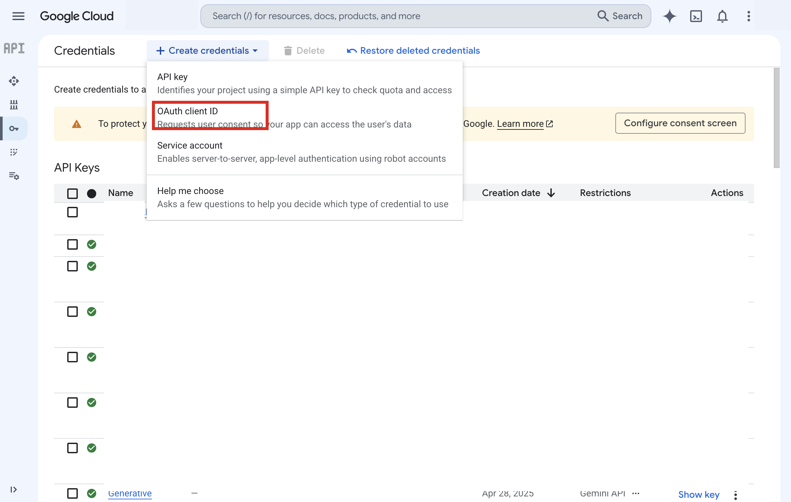
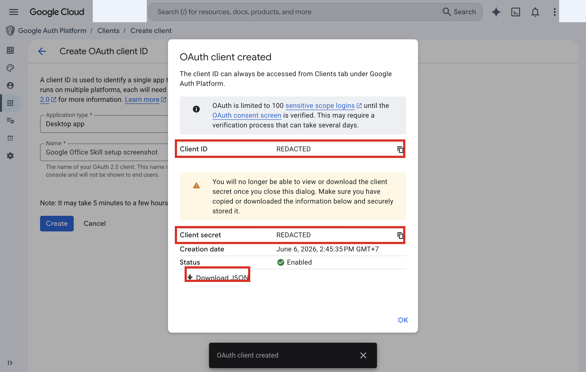

# goog


`goog` is an Early Open-Source CLI for Google APIs.
It is built first for power users and AI agents who want terminal-native access to Google Drive, Google Docs, Google Sheets, Google Slides, Google Calendar, and Gmail without getting forced down a browser UI path.

Human-readable terminal workflows are the default experience.
JSON is also supported for programmatic use, but it is not the primary product surface.

The CLI uses one OAuth App for all accounts, stores Accounts, the Active Account, Tokens, and Resource Account Mappings in `~/.goog/auth.json`, and requests every supported scope up front during `goog auth login` instead of acquiring them incrementally per command.

## Current API Coverage

`goog` currently includes:

- Google Drive file and folder listing, upload, and download commands.
- Google Docs document listing, creation, mapping, text search, content lookup, high-level text/image/table/style/list edits, page and section breaks, headers, footers, footnotes, named ranges, raw document reads, and raw batch updates.
- Google Sheets spreadsheet listing, reads, values reads and writes, appends, clears, and structural batch updates.
- Google Slides presentation listing, creation, raw reads, high-level slide/text/image/table/shape edits, and raw batch updates.
- Google Calendar calendar listing, calendar metadata reads, free/busy lookup, and event list/read/create/update/delete commands.
- Gmail message listing, search, raw message reads, draft creation, and attachment downloads.
- Multi-account OAuth setup, login, account listing, and active account switching.

## Installation

Install `goog` on macOS or Linux with:

```sh
curl -fsSL https://raw.githubusercontent.com/SainyTK/goog-cli/main/install.sh | sh
```

## OAuth Setup

Create a Google OAuth client for a desktop or web application, then configure `goog` once:

```sh
goog auth setup
```

### Google Cloud Console Setup Guide

Open <https://console.cloud.google.com>, create a project or select an existing one, then complete the setup below before running `goog auth setup`.

#### 1. Enable the required APIs

Go to **APIs & Services -> Library**.



Enable these APIs:

- Google Drive API
- Google Docs API
- Google Sheets API
- Google Slides API
- Google Calendar API
- Gmail API

If an API already shows **Manage** with an **API Enabled** badge, skip it.


#### 2. Configure the OAuth consent screen

If this is a brand-new project, go to **APIs & Services -> OAuth consent screen**.

In the newer GCP layout, this may appear under **Google Auth Platform -> Branding**.

If the consent screen is already configured, skip to the next step.

Choose **External** for personal Google accounts.

Fill in the required fields:

- **App name**: any descriptive name, such as `My Office Agent`
- **User support email**: your email address
- **Developer contact information**: your email address

All other fields can stay blank.


Click **Save and Continue**.

Because the app stays in **Testing** mode by default, add your own Google account under **Test users** before finishing the flow.


#### 3. Create OAuth credentials

Go to **APIs & Services -> Credentials**.

Click **+ Create credentials**.



Select **OAuth client ID**.



#### 4. Choose Desktop app

On the client creation form, set **Application type** to **Desktop app**.


Enter any descriptive name, then click **Create**.


#### 5. Copy the client ID and client secret

After the client is created, copy both values from the dialog:

- **Client ID**: a long value ending in `.apps.googleusercontent.com`
- **Client secret**: a shorter value usually starting with `GOCSPX-`



Copy both values before closing the dialog.

You can also use **Download JSON** if you prefer the file-based `--client-secret-file` setup path.

You can also import a downloaded Google client secret file:

```sh
goog auth setup --client-secret-file client_secret_123.apps.googleusercontent.com.json
```

Authorize a Google Account:

```sh
goog auth login
```

List authorized Accounts:

```sh
goog auth list
goog auth list --json
```

Switch the Active Account:

```sh
goog auth switch alice@example.com
```

Run one command against a different Account without switching:

```sh
goog --account bob@example.com drive ls
```

## Examples

### Drive

```sh
goog drive ls --limit 20
goog drive ls --type folders --folder FOLDER_ID --json
goog drive ls --show-all
goog drive upload ./report.pdf --folder FOLDER_ID
goog drive download FILE_ID --output ./report.pdf
```

Drive listings exclude soft-deleted items by default.
Use `--show-all` to include them.

### Docs

```sh
goog docs list --limit 20
goog docs create "Q3 Report"
goog docs map DOCUMENT_ID
goog docs map DOCUMENT_ID --type images
goog docs map DOCUMENT_ID --type tables
goog docs map DOCUMENT_ID --heading "Summary"
goog docs text search DOCUMENT_ID "quarterly plan"
goog docs image insert DOCUMENT_ID "https://example.test/chart.png" --at 'heading:Summary'
goog docs image insert DOCUMENT_ID "https://example.test/chart.png" --max-width 468 --max-height 500 --at 'heading:Summary'
goog docs break page DOCUMENT_ID --at 'heading:Summary'
goog docs break section DOCUMENT_ID --section-type next-page --at 'heading:Appendix'
goog docs header create DOCUMENT_ID
goog docs footer create DOCUMENT_ID
goog docs footnote insert DOCUMENT_ID --at 'after-text:quarterly plan'
goog docs named-range create DOCUMENT_ID "highlights" --text "quarterly plan"
goog docs named-range delete DOCUMENT_ID --name "highlights"
goog docs batch-update DOCUMENT_ID --requests ./requests.json
```

Maximum image dimensions preserve the source aspect ratio and do not upscale by default.
Exact `--width` and `--height` values are checked against the source aspect ratio and require `--allow-distortion` when they would change it.
The conversion uses 96 source pixels per inch and 72 Google Docs points per inch, with results rounded to three decimal places.
For JPEG images, EXIF orientations 5 through 8 swap the encoded width and height so fitting uses the displayed orientation.

### Sheets

```sh
goog sheets create "Quarterly Plan"
goog sheets list --limit 20
goog sheets get SPREADSHEET_ID --fields 'properties.title,sheets.properties'
goog sheets sheet add SPREADSHEET_ID "Raw Data"
goog sheets sheet rename SPREADSHEET_ID 123456789 "Archive"
goog sheets sheet move SPREADSHEET_ID 123456789 0
goog sheets sheet duplicate SPREADSHEET_ID 123456789 "Archive Copy"
goog sheets sheet freeze SPREADSHEET_ID 123456789 --rows 1 --columns 2
goog sheets sheet resize SPREADSHEET_ID 123456789 --rows 200 --columns 12
goog sheets sheet auto-resize SPREADSHEET_ID 123456789 --dimension columns --start-index 0 --end-index 5
goog sheets sheet set-dimension-size SPREADSHEET_ID 123456789 --dimension rows --start-index 1 --end-index 3 --pixel-size 28
goog sheets sheet hide-dimension SPREADSHEET_ID 123456789 --dimension columns --start-index 1 --end-index 3
goog sheets sheet unhide-dimension SPREADSHEET_ID 123456789 --dimension columns --start-index 1 --end-index 3
goog sheets sheet group-dimension SPREADSHEET_ID 123456789 --dimension rows --start-index 1 --end-index 10
goog sheets sheet ungroup-dimension SPREADSHEET_ID 123456789 --dimension rows --start-index 1 --end-index 10
goog sheets sheet collapse-dimension-group SPREADSHEET_ID 123456789 --dimension rows --start-index 1 --end-index 10
goog sheets sheet expand-dimension-group SPREADSHEET_ID 123456789 --dimension rows --start-index 1 --end-index 10
goog sheets sheet insert-dimension SPREADSHEET_ID 123456789 --dimension rows --start-index 2 --end-index 4 --inherit-from-before
goog sheets sheet delete-dimension SPREADSHEET_ID 123456789 --dimension columns --start-index 3 --end-index 6
goog sheets sheet basic-filter SPREADSHEET_ID 123456789 --start-row 0 --end-row 100 --start-column 0 --end-column 5
goog sheets sheet clear-basic-filter SPREADSHEET_ID 123456789
goog sheets sheet merge SPREADSHEET_ID 123456789 --start-row 0 --end-row 2 --start-column 0 --end-column 4 --merge-type all
goog sheets sheet unmerge SPREADSHEET_ID 123456789 --start-row 0 --end-row 2 --start-column 0 --end-column 4
goog sheets sheet sort-range SPREADSHEET_ID 123456789 --start-row 1 --end-row 100 --start-column 0 --end-column 5 --sort-column 3 --order descending
goog sheets sheet delete-duplicates SPREADSHEET_ID 123456789 --start-row 1 --end-row 100 --start-column 0 --end-column 5 --comparison-column 1 --comparison-column 3
goog sheets sheet trim-whitespace SPREADSHEET_ID 123456789 --start-row 1 --end-row 100 --start-column 0 --end-column 5
goog sheets sheet randomize-range SPREADSHEET_ID 123456789 --start-row 1 --end-row 100 --start-column 0 --end-column 5
goog sheets sheet find-replace SPREADSHEET_ID "draft" "final" --sheet-id 123456789 --match-case
goog sheets sheet copy-paste SPREADSHEET_ID 123456789 --source-start-row 1 --source-end-row 4 --source-start-column 0 --source-end-column 3 --destination-sheet-id 987654321 --destination-start-row 10 --destination-end-row 13 --destination-start-column 0 --destination-end-column 3 --paste-type values
goog sheets sheet cut-paste SPREADSHEET_ID 123456789 --source-start-row 1 --source-end-row 4 --source-start-column 0 --source-end-column 3 --destination-sheet-id 987654321 --destination-row 10 --destination-column 0 --paste-type values
goog sheets sheet background-color SPREADSHEET_ID 123456789 --start-row 0 --end-row 1 --start-column 0 --end-column 5 "#ffcc00"
goog sheets sheet text-color SPREADSHEET_ID 123456789 --start-row 0 --end-row 1 --start-column 0 --end-column 5 "#3366cc"
goog sheets sheet font-size SPREADSHEET_ID 123456789 --start-row 0 --end-row 1 --start-column 0 --end-column 5 --size 14
goog sheets sheet font-family SPREADSHEET_ID 123456789 --start-row 0 --end-row 1 --start-column 0 --end-column 5 --family Roboto
goog sheets sheet number-format SPREADSHEET_ID 123456789 --start-row 1 --end-row 100 --start-column 3 --end-column 4 --type currency --pattern '$#,##0.00'
goog sheets sheet borders SPREADSHEET_ID 123456789 --start-row 0 --end-row 10 --start-column 0 --end-column 5 --edge outer --style solid-thick --color "#3366cc"
goog sheets sheet clear-format SPREADSHEET_ID 123456789 --start-row 0 --end-row 10 --start-column 0 --end-column 5
goog sheets sheet bold SPREADSHEET_ID 123456789 --start-row 0 --end-row 1 --start-column 0 --end-column 5
goog sheets sheet italic SPREADSHEET_ID 123456789 --start-row 0 --end-row 1 --start-column 0 --end-column 5
goog sheets sheet underline SPREADSHEET_ID 123456789 --start-row 0 --end-row 1 --start-column 0 --end-column 5
goog sheets sheet strikethrough SPREADSHEET_ID 123456789 --start-row 0 --end-row 1 --start-column 0 --end-column 5
goog sheets sheet horizontal-align SPREADSHEET_ID 123456789 --start-row 0 --end-row 1 --start-column 0 --end-column 5 --alignment center
goog sheets sheet vertical-align SPREADSHEET_ID 123456789 --start-row 0 --end-row 1 --start-column 0 --end-column 5 --alignment middle
goog sheets sheet text-wrap SPREADSHEET_ID 123456789 --start-row 0 --end-row 10 --start-column 0 --end-column 5 --strategy wrap
goog sheets sheet text-rotation SPREADSHEET_ID 123456789 --start-row 0 --end-row 1 --start-column 0 --end-column 5 --angle 45
goog sheets sheet text-direction SPREADSHEET_ID 123456789 --start-row 0 --end-row 10 --start-column 0 --end-column 5 --direction right-to-left
goog sheets sheet note SPREADSHEET_ID 123456789 --start-row 1 --end-row 2 --start-column 3 --end-column 4 "Check source data"
goog sheets sheet note SPREADSHEET_ID 123456789 --start-row 1 --end-row 2 --start-column 3 --end-column 4 --clear
goog sheets sheet data-validation-list SPREADSHEET_ID 123456789 --start-row 1 --end-row 100 --start-column 2 --end-column 3 --value Open --value Closed --input-message "Pick a status"
goog sheets sheet data-validation-list SPREADSHEET_ID 123456789 --start-row 1 --end-row 100 --start-column 2 --end-column 3 --clear
goog sheets sheet data-validation-checkbox SPREADSHEET_ID 123456789 --start-row 1 --end-row 100 --start-column 0 --end-column 1 --input-message "Mark done"
goog sheets sheet data-validation-checkbox SPREADSHEET_ID 123456789 --start-row 1 --end-row 100 --start-column 0 --end-column 1 --checked-value Done --unchecked-value Todo
goog sheets sheet data-validation-checkbox SPREADSHEET_ID 123456789 --start-row 1 --end-row 100 --start-column 0 --end-column 1 --clear
goog sheets sheet conditional-format-color SPREADSHEET_ID 123456789 --start-row 1 --end-row 100 --start-column 3 --end-column 4 --condition number-greater --value 100 --background-color "#ffcccc"
goog sheets sheet conditional-format-update SPREADSHEET_ID 123456789 0 --start-row 1 --end-row 100 --start-column 3 --end-column 4 --condition text-contains --value Blocked --background-color "#ffeeee"
goog sheets sheet conditional-format-delete SPREADSHEET_ID 123456789 0
goog sheets sheet conditional-format-move SPREADSHEET_ID 123456789 2 0
goog sheets sheet protect-range SPREADSHEET_ID 123456789 --start-row 0 --end-row 1 --start-column 0 --end-column 5 --description "Lock headers"
goog sheets sheet protect-range SPREADSHEET_ID 123456789 --start-row 1 --end-row 100 --start-column 0 --end-column 5 --warning-only
goog sheets sheet add-named-range SPREADSHEET_ID 123456789 HeaderCells --start-row 0 --end-row 1 --start-column 0 --end-column 5
goog sheets sheet delete-named-range SPREADSHEET_ID header_cells
goog sheets sheet update-named-range SPREADSHEET_ID header_cells --name HeaderRows --sheet-id 123456789 --start-row 0 --end-row 2 --start-column 0 --end-column 5
goog sheets sheet update-protected-range SPREADSHEET_ID 7 --description "Warn before editing" --warning-only
goog sheets sheet update-protected-range SPREADSHEET_ID 7 --enforce
goog sheets sheet unprotect-range SPREADSHEET_ID 7
goog sheets sheet tab-color SPREADSHEET_ID 123456789 "#3366cc"
goog sheets sheet clear-tab-color SPREADSHEET_ID 123456789
goog sheets sheet hide SPREADSHEET_ID 123456789
goog sheets sheet unhide SPREADSHEET_ID 123456789
goog sheets sheet delete SPREADSHEET_ID 123456789
goog sheets values get SPREADSHEET_ID 'Sheet1!A1:D10'
goog sheets values get-cell SPREADSHEET_ID 'Sheet1!D2' --value-render-option formula
goog sheets values get-row SPREADSHEET_ID 'Sheet1!A2:D2' --value-render-option formula
goog sheets values get-column SPREADSHEET_ID 'Sheet1!D2:D10' --value-render-option unformatted-value
goog sheets values get-table SPREADSHEET_ID 'Sheet1!A1:D10' --value-render-option formula
goog sheets values get-table SPREADSHEET_ID 'Sheet1!A1:D10' --format csv
goog sheets values update SPREADSHEET_ID 'Sheet1!A1' --values ./value-range.json
goog sheets values update-cell SPREADSHEET_ID 'Sheet1!D2' '=SUM(C2:C10)'
goog sheets values update-row SPREADSHEET_ID 'Sheet1!A2:C2' --value Ada --value Lovelace --value '=SUM(C2:C10)'
goog sheets values update-column SPREADSHEET_ID 'Sheet1!D2:D4' --value Open --value Closed --value Blocked
goog sheets values update-table SPREADSHEET_ID 'Sheet1!A1:D10' --data ./rows.csv
cat rows.csv | goog sheets values update-table SPREADSHEET_ID 'Sheet1!A1:D10' --data - --format csv
goog sheets values append SPREADSHEET_ID 'Sheet1!A:D' --values ./rows.json
goog sheets values append-row SPREADSHEET_ID 'Sheet1!A:D' --value Ada --value Lovelace --value '=SUM(C2:C10)'
goog sheets values append-column SPREADSHEET_ID 'Sheet1!A:D' --value Open --value Closed --value Blocked
goog sheets values append-table SPREADSHEET_ID 'Sheet1!A:D' --data ./rows.csv
cat rows.tsv | goog sheets values append-table SPREADSHEET_ID 'Sheet1!A:D' --data - --format tsv
```

### Slides

```sh
goog slides list --limit 20
goog slides create "Quarterly Review"
goog slides get PRESENTATION_ID
goog slides get PRESENTATION_ID --fields 'presentationId,title,slides(objectId)' --json
goog slides slide create PRESENTATION_ID --layout title-and-body --object-id agenda-slide
goog slides slide duplicate PRESENTATION_ID SLIDE_OBJECT_ID --object-id copied-slide --insertion-index 1
goog slides slide move PRESENTATION_ID --page-id SLIDE_OBJECT_ID --insertion-index 1
goog slides slide background PRESENTATION_ID SLIDE_OBJECT_ID --color "#fbbc04"
goog slides slide delete PRESENTATION_ID SLIDE_OBJECT_ID
goog slides text-box PRESENTATION_ID --page-id SLIDE_OBJECT_ID --text "Executive summary" --x 72 --y 72 --width 360 --height 120
goog slides image PRESENTATION_ID --page-id SLIDE_OBJECT_ID --url https://example.com/chart.png --x 72 --y 216 --width 360 --height 240
goog slides video PRESENTATION_ID --page-id SLIDE_OBJECT_ID --video-id dQw4w9WgXcQ --x 72 --y 216 --width 360 --height 240
goog slides object replace-image PRESENTATION_ID IMAGE_OBJECT_ID --url https://example.com/new-chart.png --method center-crop
goog slides table PRESENTATION_ID --page-id SLIDE_OBJECT_ID --rows 4 --columns 3 --x 72 --y 72 --width 360 --height 180
goog slides table-fill PRESENTATION_ID TABLE_OBJECT_ID --row "Metric|Value" --row 'ARR|$1.2M'
goog slides table-insert-rows PRESENTATION_ID TABLE_OBJECT_ID --reference-row 1 --number 2 --below
goog slides table-delete-row PRESENTATION_ID TABLE_OBJECT_ID --reference-row 1
goog slides table-insert-columns PRESENTATION_ID TABLE_OBJECT_ID --reference-column 1 --number 2 --right
goog slides table-delete-column PRESENTATION_ID TABLE_OBJECT_ID --reference-column 1
goog slides table-merge-cells PRESENTATION_ID TABLE_OBJECT_ID --start-row 0 --start-column 0 --row-span 1 --column-span 2
goog slides table-unmerge-cells PRESENTATION_ID TABLE_OBJECT_ID --start-row 0 --start-column 0 --row-span 1 --column-span 2
goog slides shape PRESENTATION_ID --page-id SLIDE_OBJECT_ID --type round-rectangle --x 72 --y 72 --width 240 --height 96
goog slides line PRESENTATION_ID --page-id SLIDE_OBJECT_ID --category straight --x 72 --y 72 --width 240 --height 0
goog slides object style PRESENTATION_ID PAGE_OBJECT_ID --fill-color "#1a73e8" --outline-color "#202124" --outline-weight 2
goog slides object line-style PRESENTATION_ID LINE_OBJECT_ID --color "#1a73e8" --weight 3
goog slides object insert-text PRESENTATION_ID PAGE_OBJECT_ID --text "Updated takeaway" --index 0
goog slides object delete-text PRESENTATION_ID PAGE_OBJECT_ID --start-index 0 --end-index 7
goog slides object text-style PRESENTATION_ID PAGE_OBJECT_ID --color "#202124" --font-family Georgia --font-size 18 --bold --italic false --start-index 0 --end-index 17
goog slides object alt-text PRESENTATION_ID PAGE_OBJECT_ID --title "Pipeline chart" --description "Bar chart showing qualified pipeline by stage"
goog slides object move PRESENTATION_ID PAGE_OBJECT_ID --x 96 --y 144 --scale-x 1.2 --scale-y 1.2
goog slides object order PRESENTATION_ID --object-id PAGE_OBJECT_ID --operation bring-to-front
goog slides object group PRESENTATION_ID --object-id SHAPE_OBJECT_ID --object-id IMAGE_OBJECT_ID --group-id hero-group
goog slides object ungroup PRESENTATION_ID --object-id hero-group
goog slides replace-text PRESENTATION_ID --find "{{client_name}}" --replace "Acme Co." --page-id SLIDE_OBJECT_ID
goog slides object delete PRESENTATION_ID PAGE_OBJECT_ID
goog slides batch-update PRESENTATION_ID --requests ./slides-requests.json
```

### Calendar

```sh
goog calendar calendars list --limit 20
goog calendar calendars get primary
goog calendar calendars create --summary "Team Launches" --time-zone Asia/Bangkok --description "Launch planning calendar"
goog calendar calendars update team-launches@example.com --summary "Team Launches Updated" --time-zone Asia/Bangkok --description "Launch planning and retros"
goog calendar calendars patch team-launches@example.com --description "Launch planning, retros, and launch notes"
goog calendar calendars list-entry add team-launches@example.com --summary-override "Launches" --selected true --color-id 2
goog calendar calendars list-entry get team-launches@example.com
goog calendar calendars list-entry update team-launches@example.com --summary-override "Launches" --selected true --color-id 2 --default-reminder popup:10
goog calendar calendars list-entry patch team-launches@example.com --summary-override "Launches" --selected true --color-id 2 --default-reminder popup:10
goog calendar calendars list-entry delete team-launches@example.com
goog calendar calendars delete team-launches@example.com
goog calendar colors get
goog calendar acl list team-launches@example.com --limit 20
goog calendar acl get team-launches@example.com user:teammate@example.com
goog calendar acl add team-launches@example.com --scope user --value teammate@example.com --role writer --no-send-notifications
goog calendar acl update team-launches@example.com user:teammate@example.com --scope user --value teammate@example.com --role writer
goog calendar acl patch team-launches@example.com user:teammate@example.com --role reader
goog calendar acl delete team-launches@example.com user:teammate@example.com
goog calendar freebusy --time-min 2026-07-09T09:00:00Z --time-max 2026-07-09T17:00:00Z --calendar primary --calendar teammate@example.com
goog calendar events list primary --time-min 2026-07-09T00:00:00Z --time-max 2026-07-10T00:00:00Z --time-zone Asia/Bangkok --single-events
goog calendar events list primary --updated-min 2026-07-08T00:00:00Z --show-deleted --show-hidden-invitations --order-by updated --json
goog calendar events list primary --sync-token NEXT_SYNC_TOKEN --json
goog calendar events list primary --i-cal-uid abc123@example.com --json
goog calendar events list primary --private-extended-property owner=agent --shared-extended-property project=alpha --json
goog calendar events list primary --event-type out-of-office --event-type working-location --max-attendees 3 --json
goog calendar events get primary EVENT_ID
goog calendar events get primary EVENT_ID --json
goog calendar events instances primary RECURRING_EVENT_ID --time-min 2026-07-09T00:00:00Z --time-max 2026-07-30T00:00:00Z
goog calendar events create primary --summary "Planning" --start 2026-07-09T09:00:00+07:00 --end 2026-07-09T09:30:00+07:00 --time-zone Asia/Bangkok --attendee teammate@example.com --recurrence "RRULE:FREQ=WEEKLY;COUNT=4" --reminder popup:10 --color-id 5 --google-meet --send-updates all
goog calendar events create primary --summary "Out of office" --start 2026-07-09 --end 2026-07-10 --all-day
goog calendar events create primary --event ./event.json
goog calendar events import primary --summary "Imported planning" --start 2026-07-09T09:00:00+07:00 --end 2026-07-09T09:30:00+07:00 --time-zone Asia/Bangkok
goog calendar events import primary --event ./event.json
goog calendar events quick-add primary "Lunch with Sam tomorrow at noon" --send-updates none
goog calendar events update primary EVENT_ID --summary "Planning moved" --start 2026-07-09T10:00:00+07:00 --end 2026-07-09T10:30:00+07:00 --time-zone Asia/Bangkok --send-updates external-only
goog calendar events update primary EVENT_ID --event ./event.json
goog calendar events patch primary EVENT_ID --summary "Planning renamed" --location "Office" --color-id 7 --google-meet --meet-request-id planning-meet-1 --no-reminders --send-updates none
goog calendar events move primary EVENT_ID --destination team@example.com
goog calendar events delete primary EVENT_ID --send-updates all
```

### Gmail

```sh
goog mail list --limit 10
goog mail list 'from:alerts@example.com newer_than:7d'
goog mail read MESSAGE_ID
goog mail draft --to teammate@example.com --subject 'Status update' --body @./message.txt --attachment ./report.pdf
goog mail download MESSAGE_ID ATTACHMENT_ID --output invoice.pdf
```

Use `goog help`, `goog <command> --help`, and nested command help for the full command reference.

### Additional Installation Options

The installer script installs the latest Stable LTS Canonical Release by default.
It installs to `/usr/local/bin` when that directory is writable.
If `/usr/local/bin` is not writable, it installs to `$HOME/.local/bin` and prints a PATH warning if needed.
The installer supports macOS arm64, macOS x64, Linux x64, and Linux arm64 Release Assets.

Install the latest preview pre-release with:

```sh
curl -fsSL https://raw.githubusercontent.com/SainyTK/goog-cli/main/install.sh | sh -s -- --channel preview
```

Install a specific Canonical Release with:

```sh
curl -fsSL https://raw.githubusercontent.com/SainyTK/goog-cli/main/install.sh | sh -s -- --version v0.2.3
```

Check which release source produced the installed binary with:

```sh
goog version --json
```

For a Canonical Release, compare `sourceTag` and `gitCommit` with the tag and commit on the corresponding GitHub Release.
`releaseChannel` identifies a stable, preview, or development build, and `dirty` must be `false` for a published binary.

Users outside the binary release support matrix can install from source with Cargo:

```sh
cargo install --git https://github.com/SainyTK/goog-cli goog
```

### Uninstall

If you installed with the installer script, remove the binary from the supported install locations:

```sh
rm -f /usr/local/bin/goog "$HOME/.local/bin/goog"
```

If you installed with Cargo, uninstall the Cargo package:

```sh
cargo uninstall goog
```

Those commands remove the executable only.
To fully reset local `goog` state, delete `$HOME/.goog`.
That directory contains OAuth App setup in `config.toml` and auth state in `auth.json`.
The auth state file grants account access within authorized scopes, so do not commit it or sync it into places you do not trust.

### Limitations

- **`goog` cannot write Office files (.xlsx, .docx) in Drive.** Writing to an Excel-format spreadsheet (`values update`, `values append`, `batch-update`) or a Word-format document (`batch-update`) is not supported. This is a Google Sheets/Docs API restriction, not a `goog` gap: neither API can write to `.xlsx` or `.docx` files at all. Convert the file to a native Google Sheet or Google Doc first (Drive UI: File > Save as Google Sheets/Docs) to edit it with `goog`.

## Release Flow

`goog` has two release channels.
Preview releases are for opt-in validation before stable promotion.
Stable LTS releases are the default install path.

### Preview Release

Start from `develop` or the release-prep branch.
Run the release checks:

```sh
cargo fmt --check
cargo test
cargo test --test distribution_artifacts_tests
```

Bump `Cargo.toml` to a preview version such as `0.2.4-preview.2`, then let Cargo update `Cargo.lock`.
Push the tested commit to `develop` and `preview`.
Create and push a matching preview tag:

```sh
git push origin develop
git push origin HEAD:preview
git tag v0.2.4-preview.2
git push origin v0.2.4-preview.2
```

The `Canonical Release` workflow requires preview tags to be reachable from `origin/preview`.
It publishes a GitHub pre-release.
After the workflow succeeds, verify the preview installer against a temporary directory:

```sh
tmp="$(mktemp -d)"
git show origin/preview:install.sh | sh -s -- --channel preview --install-dir "$tmp/bin"
"$tmp/bin/goog" --version
rm -rf "$tmp"
```

### Stable LTS Release

Promote a tested preview by merging or fast-forwarding the release commit into `main`.
Replace the preview package version with the stable version in `Cargo.toml`, then let Cargo update `Cargo.lock`.
Run the release checks again.
Create and push a stable tag:

```sh
git checkout main
git pull --ff-only origin main
git tag v0.2.4
git push origin v0.2.4
```

The `Canonical Release` workflow requires stable tags to be reachable from `origin/main`.
It publishes the stable GitHub Release.
After the workflow succeeds, verify the default installer against a temporary directory:

```sh
tmp="$(mktemp -d)"
curl -fsSL https://raw.githubusercontent.com/SainyTK/goog-cli/main/install.sh | sh -s -- --install-dir "$tmp/bin"
"$tmp/bin/goog" --version
rm -rf "$tmp"
```

## Contributor Workflow

Install local dependencies:

```sh
cargo fetch
npm install
```

Run checks before opening a pull request:

```sh
cargo fmt --check
cargo test
npm run typecheck
```

Issues live in GitHub Issues.
Pick work labeled `ready-for-agent` or `bug` (there is no separate `Sandcastle` label), keep changes scoped to the issue, and link the issue from the pull request.

Pull requests should include:

- A concise summary of user-facing behavior.
- Tests or verification notes covering the changed behavior.
- Documentation updates when commands, OAuth behavior, or distribution paths change.
- Release-document updates when Canonical Release assets, installer behavior, or operator steps change.

Distribution changes must keep GitHub Releases as the only Canonical Release authority.
